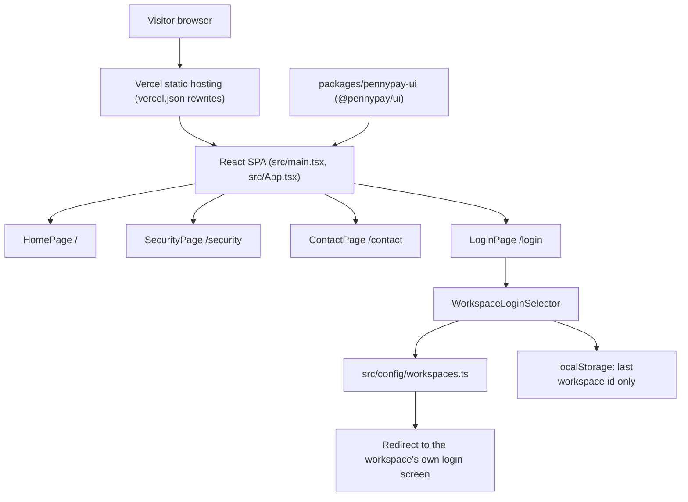

# PennyPay Marketing

Public marketing and workspace entry site for `dulciepay.com.au`. It is a static React site built with Vite and deployed on Vercel.

## Overview

- Serves four public routes: `/`, `/login`, `/security` and `/contact`.
- `/login` is only a workspace selector. It redirects the visitor to the chosen workspace's own login screen.
- It does not collect email or password fields, start OAuth, run MFA, passkey or reset flows, create Supabase sessions, implement shared SSO, call private APIs, or authorize users.
- The only thing stored in the browser is the id of the last selected workspace.
- UI tokens and components come from a local workspace copy of `@pennypay/ui`, because that package is unpublished.

## Architecture



The diagram source is in [docs/architecture.mmd](docs/architecture.mmd).

## Repository map

```text
index.html                 Vite HTML entry
src/
  main.tsx                 React entry point
  App.tsx                  route switch for the four public pages
  pages/                   HomePage, LoginPage, SecurityPage, ContactPage
  components/              nav, hero, footer, WorkspaceLoginSelector
  config/workspaces.ts     workspace list and login redirect targets
  config/workspaces.test.ts  Vitest checks for the redirects
  styles.css               site styles
packages/pennypay-ui/      local copy of the @pennypay/ui design system
scripts/copy-spa-routes.mjs  copies index.html into dist/login, dist/security, dist/contact
public/logo.png            static asset
vercel.json                Vercel build, rewrites and security headers
pnpm-workspace.yaml        pnpm workspace definition
vite.config.ts             Vite config
```

## Getting started

Prerequisites: Node 22 or newer and pnpm 10.

```sh
pnpm install
pnpm dev
pnpm test
pnpm build
```

`pnpm build` type checks, runs the Vite build, then copies `index.html` into each route folder so direct links work on static hosting.

## Configuration

No environment variables are read. Workspace names and login URLs live in `src/config/workspaces.ts`.

## Deployment

Vercel builds the site using `vercel.json`: `pnpm install --frozen-lockfile`, `pnpm build`, output directory `dist`. All paths rewrite to `index.html`, and responses carry `X-Content-Type-Options` and `Referrer-Policy` headers.

## Documentation

- [Architecture diagram source](docs/architecture.mmd)
- [Design system package notes](packages/pennypay-ui/README.md)
- [Previous README (full detail)](docs/archive/README-2026-09-18.md)
