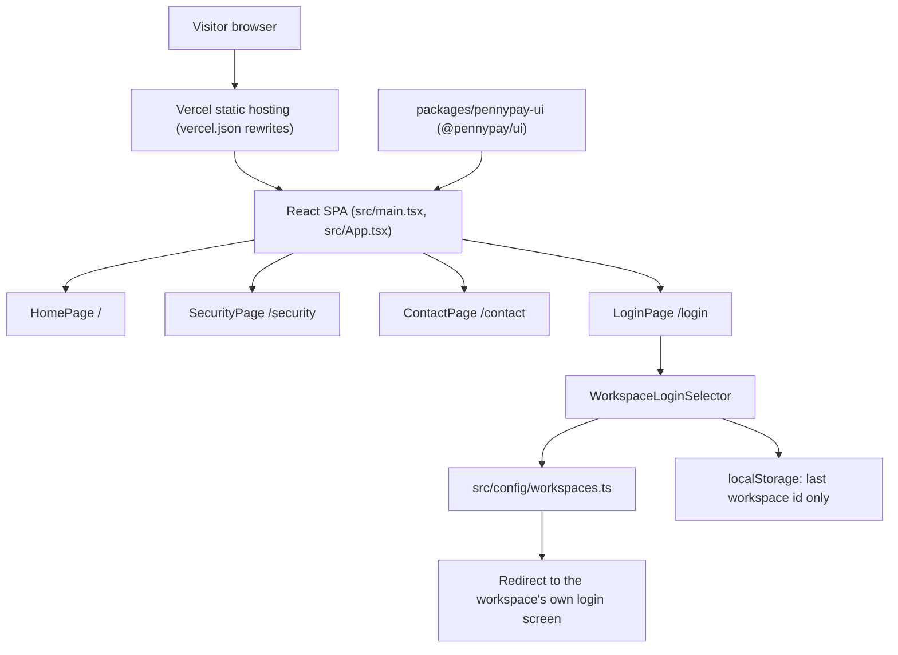

# Architecture

PennyPay Marketing is a static React single page app built with Vite and hosted on Vercel. The diagram source is [architecture.mmd](architecture.mmd).



## What the site does

- Serves four public routes: `/`, `/login`, `/security` and `/contact`.
- `/login` is only a workspace selector. It redirects the visitor to the chosen workspace's own login screen.
- It does not collect email or password fields, start OAuth, run MFA, passkey or reset flows, create Supabase sessions, implement shared SSO, call private APIs, or authorize users.
- The only thing stored in the browser is the id of the last selected workspace.
- UI tokens and components come from a local workspace copy of `@pennypay/ui`, because that package is unpublished. See [the package notes](../packages/pennypay-ui/README.md).

## Repository map

```text
index.html                 Vite HTML entry
src/
  main.tsx                 React entry point
  App.tsx                  route switch for the four public pages
  pages/                   HomePage, LoginPage, SecurityPage, ContactPage
  components/              nav, hero, footer, WorkspaceLoginSelector
  config/workspaces.ts     workspace list and login redirect targets
  config/workspaces.test.ts  Vitest checks for the redirects
  styles.css               site styles
packages/pennypay-ui/      local copy of the @pennypay/ui design system
scripts/copy-spa-routes.mjs  copies index.html into dist/login, dist/security, dist/contact
public/logo.png            static asset
vercel.json                Vercel build, rewrites and security headers
pnpm-workspace.yaml        pnpm workspace definition
vite.config.ts             Vite config
```
